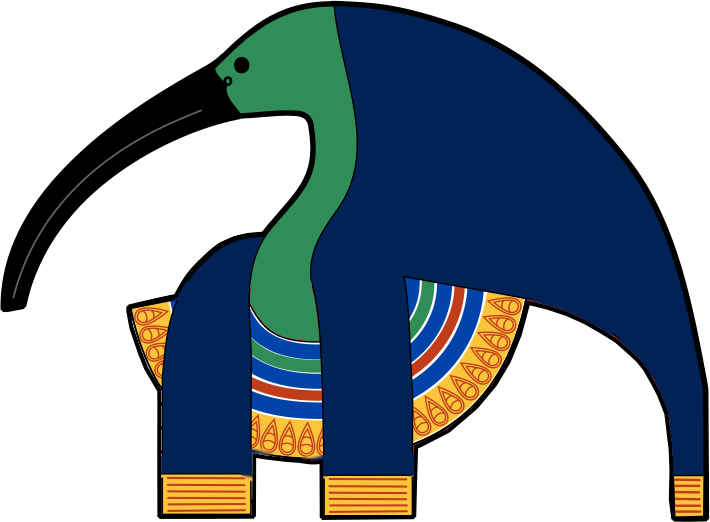

# Thoth

The **Thoth** Project consists of a private equity funds' investment simulator where the user is guided by Thoth, the AI-assistant incarnation of the Egyptian God of Gambling.

## Goal

The user has an artificial fund capital to invest as actions. The user is being advised by Thoth to either follow its recommendations in investment decisions or not.
The goal of the user is to maximize its capital with returns on investment.

## Features
### Reported confidence
Estimates the confidence of the AI in its suggestion based on history and user feedback. This value
can be used to control:
- *automated investment* when the reported confidence is over a controllable threshold
- *silenced suggestions* under a controllable reported confidence threshold

### Clear and controllable guardrails

## About

This project was developed by Aloïs Rautureau and Chanattan Sok as a Human-AI interaction project for the corresponding class at Sorbonne University.

