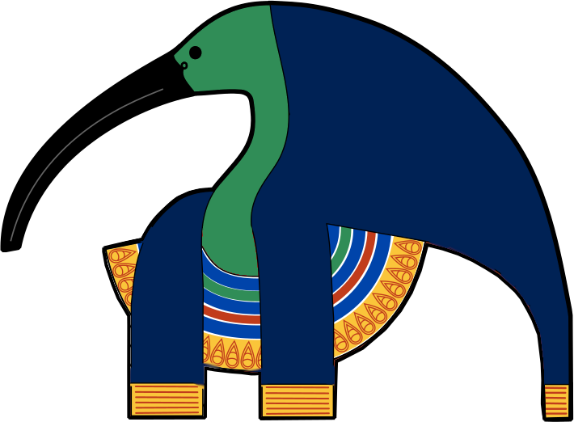

# Thoth

AI assited trading giving full control to the user.

## Features
### Reported confidence
Estimates the confidence of the AI in its suggestion based on history and user feedback. This value
can be used to control:
- *automated investment* when the reported confidence is over a controllable threshold
- *silenced suggestions* under a controllable reported confidence threshold

### Clear and controllable guardrails

